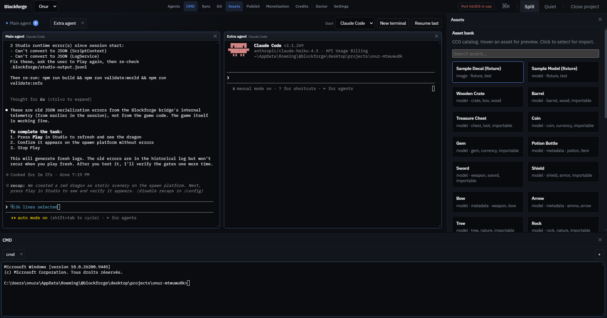
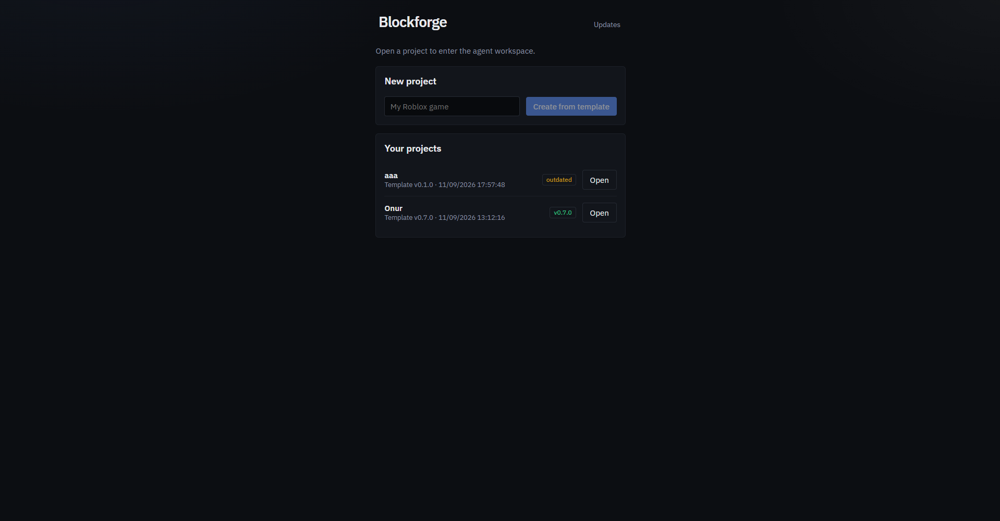
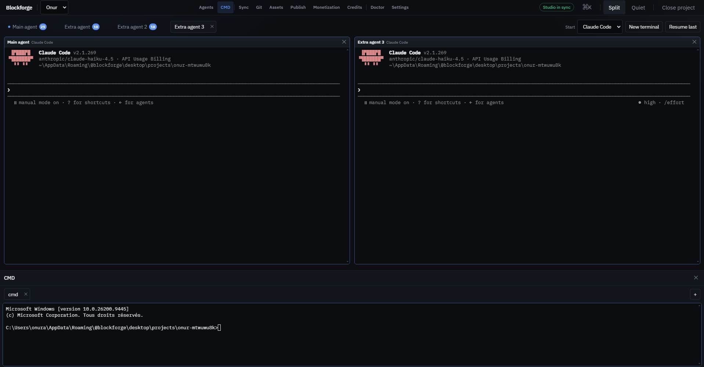
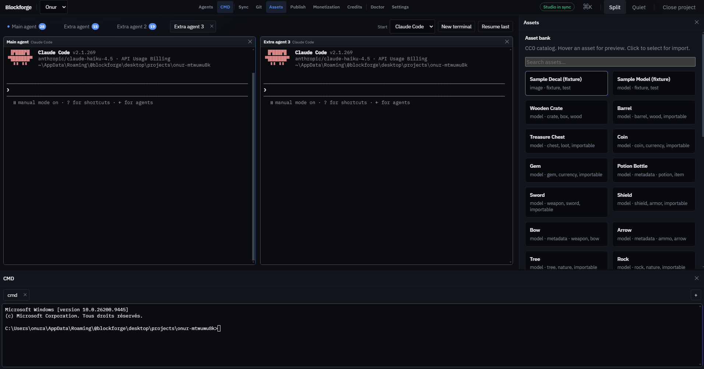
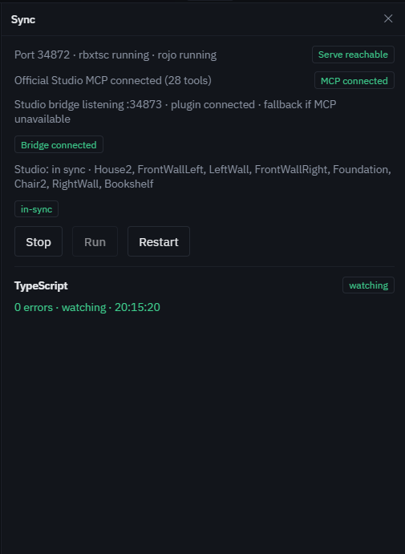
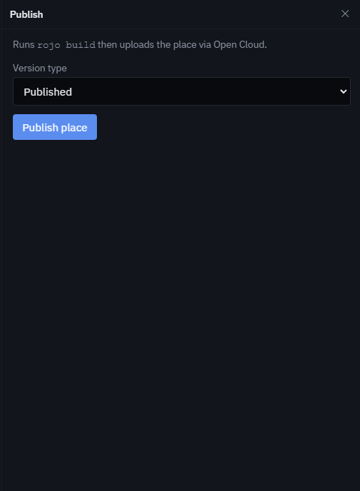
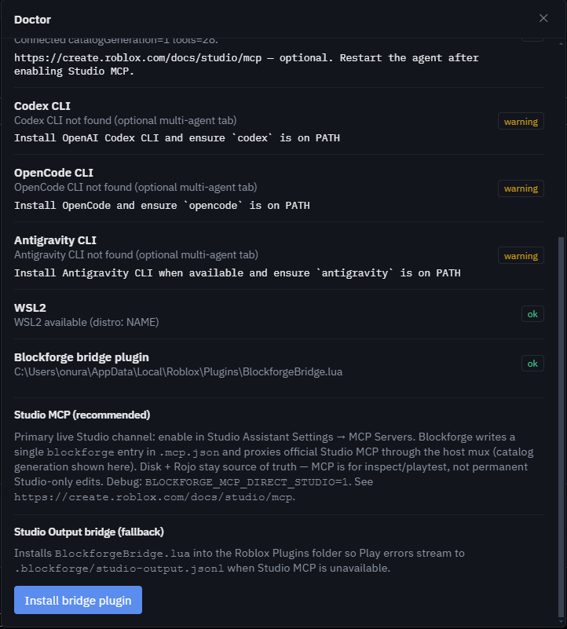

# Blockforge

Open-source desktop app for building **Roblox** games with local AI coding agents.

You describe a game. [Claude Code](https://docs.anthropic.com/en/docs/claude-code) (or Codex / OpenCode) writes **roblox-ts**. **Rojo** live-syncs into Studio. You publish with **Roblox Open Cloud**. A curated **CC0** asset bank sits in the same window.

Your project files stay on disk. Your API keys stay on your machine. Blockforge does not host models or resell coding-agent access.

> Not affiliated with Roblox Corporation or Anthropic. “Roblox” is a trademark of Roblox Corporation.

## Screenshots

Drop PNG files into [`docs/screenshots/`](docs/screenshots/README.md) using the names below. Until then, GitHub will show broken-image placeholders — that is expected.

<p align="center">
  
</p>

<p align="center"><sub>Main agent terminal — the center of the app</sub></p>

<table>
  <tr>
    <td width="50%">
      
      <p align="center"><sub>Home — create and open projects</sub></p>
    </td>
    <td width="50%">
      
      <p align="center"><sub>Swarm Mode — lead + worker agents</sub></p>
    </td>
  </tr>
  <tr>
    <td width="50%">
      
      <p align="center"><sub>Asset bank — CC0 catalog, preview, import</sub></p>
    </td>
    <td width="50%">
      
      <p align="center"><sub>Studio sync — Rojo, rbxtsc, MCP</sub></p>
    </td>
  </tr>
  <tr>
    <td width="50%">
      
      <p align="center"><sub>Publish — Open Cloud place versions</sub></p>
    </td>
    <td width="50%">
      
      <p align="center"><sub>Doctor — toolchain health</sub></p>
    </td>
  </tr>
</table>

Optional extras (not embedded yet): `git.png`, `settings.png`, `monetization.png`, `credits.png`. See the [screenshot guide](docs/screenshots/README.md).

## Features

After you open a project, the **center** is the agent terminal. Header buttons open **one inspector at a time** on the right: Sync, Git, Assets, Publish, Monetization, Credits. **Agents** can stay open at the bottom. **Doctor** and **Settings** are overlays (`Ctrl+,`). Command palette: `Ctrl+K`.

### Home

Create a new game from the roblox-ts template (copy files, `npm install`, typecheck) or open an existing project. Outdated projects show a template-upgrade hint.

### Workspace (agent terminal)

The main Claude / Codex / OpenCode session is the lead tab. You can open extra agent tabs, hide docks (**Quiet**), or put lead and worker side by side (**Split**). Layout is remembered per project. Agents run as local CLIs with their permission prompts visible — Blockforge never launches them with `--dangerously-skip-permissions`.

### Swarm Mode

A **lead Claude** plans and assigns work to reusable roles: `world-builder` (scenery in `world/`), `gameplay-coder` (TypeScript in `src/`), `qa-verifier` (build + validate). Workers cannot mark a task done if compile/validate fails. Copy the swarm starter prompt from the banner (or Cmd+K) and paste it into the lead terminal. Toggle in Settings.

### Sync (Studio + Rojo)

Keeps **disk as source of truth** and pushes it into an open Studio place:

1. `rbxtsc -w` compiles TypeScript
2. `rojo serve` live-syncs instances into Studio
3. **Studio MCP** (preferred) lets the agent inspect the DataModel, playtest, and read the console
4. A Blockforge **bridge plugin** is the fallback if MCP is offline

Start / stop / restart from this dock. Optional **experimental syncback** surfaces Studio↔disk conflicts (Keep disk / Take Studio / Open diff) — never silent overwrite.

### Assets

A searchable **CC0** catalog (Kenney, Quaternius, Poly Haven, ambientCG). Hover for image / audio / 3D preview. Import uploads `.fbx` or `.png` to Roblox Open Cloud and registers `rbxassetid://…` in the project. Audio is preview-only (Open Cloud upload quotas). You can download a curated pack, activate the `lowpoly-nature` style pack, or generate an icon with **your** Gemini key.

### Publish

Puts the **place** on Roblox — not the asset bank, not git.

1. You set Open Cloud API key, Universe ID, and Place ID in Settings
2. Blockforge runs `rojo build` to a `.rbxl`
3. It uploads that file with Open Cloud Place Publishing
4. Choose **Published** (live on the game page) or **Saved** (studio draft version)

Success shows the version number and a link to `roblox.com/games/<placeId>`. Without credentials the button stays disabled.

### Monetization

**Scaffolding for Robux products**, not a full shop engine.

You name a **developer product** (consumable, e.g. “Double Coins”) or a **game pass** (permanent), set a Robux price, and Blockforge tries to create it on the universe via Open Cloud. IDs are written to `monetization.json` so the agent can wire `MarketplaceService`. If the API call fails, you still get a `local-*` id tagged **not live on Roblox** — fix credentials before taking real payments. Example receipt script: `packages/project-template/docs/examples/monetization/`.

### Credits

**Attribution for catalog inserts**, not Roblox “credits” / player currency.

Each import is listed here and in project-root `ATTRIBUTION.md` (license, source, date). The catalog is CC0-only; keep that file in git. The two buttons underneath are **local only** (not a community CDN): export a snapshot of the project, or write a local “community pack” manifest.

### Git

In-app status, stage/unstage, commit, branch, pull/push, and a short diff. The game folder must already be a git repo (`git init`). Destructive git operations are blocked while a playtest lock is held. Zip **backups** of the project also live under Electron user data (independent of remotes).

### Doctor

Health check for Node, Git Bash, Studio, agent CLIs, Studio MCP launcher, WSL2, and the bridge plugin (with an install button). Open this first on a new machine.

### Settings

Default agent and model, Swarm Mode, prefer Studio MCP, optional WSL2 sandbox, experimental syncback. Secrets (Open Cloud key, optional **asset-upload** key, Gemini) are encrypted with OS `safeStorage` — never sent to Blockforge servers. Prompts go **CLI → your AI provider**. No telemetry by default.

Packaged installs check [GitHub Releases](https://github.com/Onur45500/blockforge/releases) on launch. A banner appears when a newer version exists; **Update** downloads it and restarts Blockforge. `pnpm dev` does not auto-update.

Windows **and macOS** installers ship from `main`. There is **no iOS / iPad app** — Blockforge is an Electron desktop shell that talks to Roblox Studio on the same computer.

Unsigned Mac builds: first open may need **Right-click → Open** (Gatekeeper). Apple notarization is still optional.

## Requirements

- Windows 10/11 (x64) **or** macOS 13+ (Intel or Apple Silicon)
- Node.js 20+ (CI uses 22)
- Git ([Git for Windows](https://git-scm.com/) on Windows — Git Bash is required for Claude Code)
- [Roblox Studio](https://create.roblox.com/)
- An agent CLI: [Claude Code](https://docs.anthropic.com/en/docs/claude-code) and/or Codex / OpenCode
- Roblox Open Cloud API key (only if you publish or upload assets)

## First Roblox project

You do **not** need an Open Cloud key to create a game and playtest in Studio. Keys are only for publish / asset upload / monetization.

1. Install [Roblox Studio](https://create.roblox.com/), [Node.js 20+](https://nodejs.org/), [Git](https://git-scm.com/) (Git Bash on Windows), and [Claude Code](https://docs.anthropic.com/en/docs/claude-code) (or Codex / OpenCode).
2. Install Blockforge from [Releases](https://github.com/Onur45500/blockforge/releases), or [run from source](#run-from-source) below.
3. Launch Blockforge and open **Doctor**. Fix anything red. Optional: **Install bridge plugin**. In Studio: Assistant Settings → MCP Servers → **Enable Studio as MCP server** ([docs](https://create.roblox.com/docs/studio/mcp)).
4. On **Home**, name the game and click **Create from template**. Blockforge copies the roblox-ts template, runs `npm install`, typechecks, then opens the workspace.
5. In Studio, open a place (empty Baseplate is fine). In Blockforge, open **Sync** and click **Start** (`rbxtsc -w` + `rojo serve`). If Studio shows “World missing”, click **Connect** in the Rojo plugin (port shown in the Sync dock, usually `34872`).
6. Type what you want in the **main agent** terminal. Disk is source of truth; Rojo pushes it into Studio. Press Play in Studio to verify.

Publish later: Settings → Open Cloud API key + Universe ID + Place ID, then the **Publish** dock.

## Run from source

```bash
# From repo root
npx pnpm install
npx pnpm --filter @blockforge/open-cloud build
npx pnpm --filter @blockforge/asset-bank ingest
npx pnpm --filter @blockforge/desktop dev
```

Then follow [First Roblox project](#first-roblox-project) from step 3.

Optional: compile the game template (`npx pnpm --filter blockforge-game build`) and run unit tests (`npx pnpm test`). Live Open Cloud publish is configured in **Settings**, not required to develop the UI.

## Repository

| Path | Purpose |
|------|---------|
| `apps/desktop` | Electron + React app (this is the product) |
| `apps/web` | Small marketing landing page |
| `packages/project-template` | roblox-ts game template, skills, swarm hooks |
| `packages/open-cloud` | Roblox Open Cloud client |
| `packages/asset-bank` | CC0 catalog ingest |
| `packages/agent-evals` | First-try generation evals |
| `docs/` | Architecture, security, course, contributing |
| `spikes/pipeline` | CI compile + Rojo build check |

## Contributing

Contributors are welcome. Read [docs/CONTRIBUTING.md](docs/CONTRIBUTING.md) and the [code of conduct](CODE_OF_CONDUCT.md).

Good first issues:

- Capture or crop README screenshots (no secrets in frame)
- Extra few-shot examples under `packages/project-template/docs/examples`
- Doctor checks for missing optional CLIs
- Playwright flow that launches the real Electron window
- Marketing site (`apps/web`) feature gallery using the same screenshots

Before a PR: `npx pnpm test` and `npx pnpm typecheck`. If you touch the game template, also compile it and run `npm run validate:world` / `validate:refs` inside `packages/project-template`.

## Docs

- [Architecture](docs/ARCHITECTURE.md)
- [Desktop workspace](docs/WORKSPACE.md)
- [Security](docs/SECURITY.md) · [Security policy](SECURITY.md)
- [Roadmap](docs/ROADMAP.md)
- [Course labs](docs/COURSE.md)
- [Changelog](CHANGELOG.md)

## License

MIT — see [LICENSE](LICENSE). Catalog entries are **CC0**; see [`packages/asset-bank`](packages/asset-bank).

## Support

If Blockforge helps you, you can [buy me a coffee](https://www.buymeacoffee.com/onurakmesei).

<a href="https://www.buymeacoffee.com/onurakmesei" target="_blank"></a>
